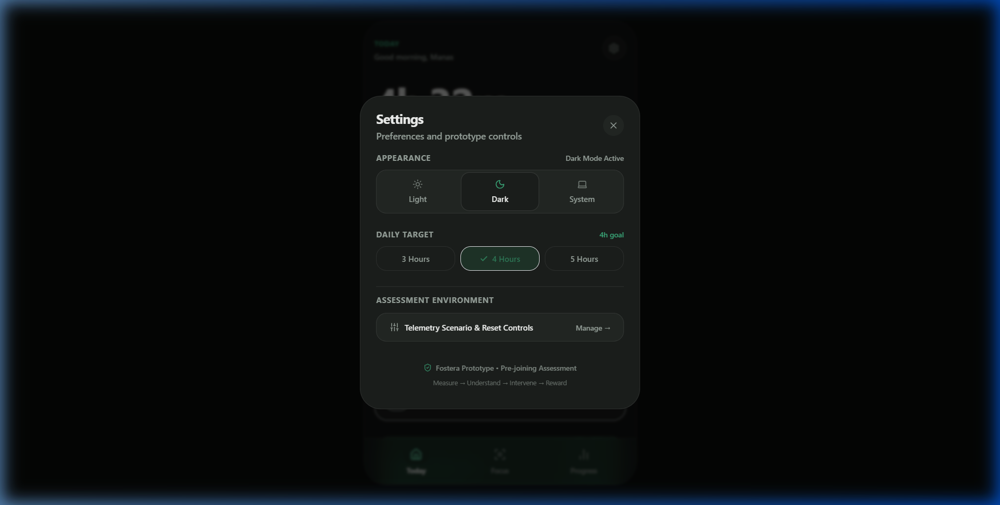
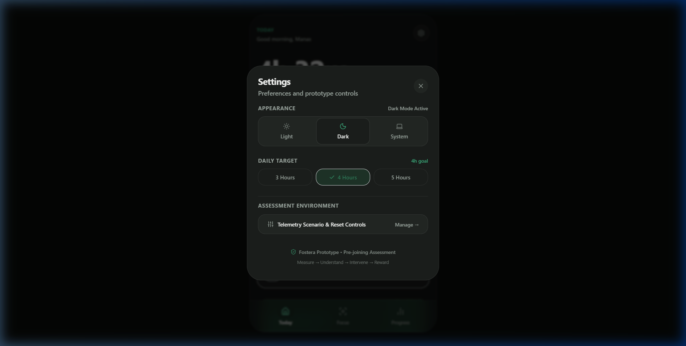
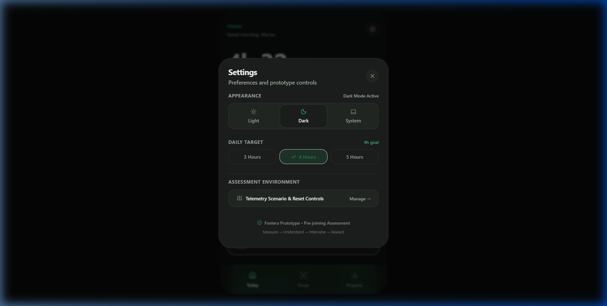

# Fostera — Digital Well-Being Prototype

A mobile-first digital well-being prototype built around the loop: Measure → Understand → Intervene → Reward.

Live Demo: https://fosteraprototype.vercel.app/
Repository: https://github.com/ManasBhardwaj07/Fostera_Prototype

## Overview

Fostera is a digital well-being concept designed to help users understand and gradually improve their screen-time habits.

The original product vision covered a much larger Android application with real device telemetry, app restrictions, scheduled blocking, gradual reduction, gamification, nudges, and an AI coach.

For the evaluation prototype, the scope was intentionally narrowed to a small, functional, frontend-first implementation that demonstrates the core product experience without pretending to have production-level Android permissions or backend infrastructure.

The prototype focuses on one complete user journey:

Measure → Understand → Decide → Intervene → Reflect → Reward

## Prototype Objective

The agreed prototype scope was to demonstrate:
- A basic mobile/web interface
- Screen-time and app-usage telemetry
- A dashboard showing total and app-wise usage
- Usage-zone calculation
- A daily screen-time target
- A simple app-limit flow
- Focus Mode with a selectable duration
- A focused session state and completion flow
- Basic progress and streak information
- A deterministic coaching insight
- Persistent local preferences
- A clean, maintainable frontend architecture
- A working browser demo
- An Android-capable foundation through Capacitor

The goal was not to reproduce the entire production Fostera application.

## What Was Built

### 1. Today Dashboard
The main dashboard answers the most important questions immediately:
- How much screen time was used today?
- Is the user within their target?
- Which usage zone are they currently in?
- Which apps contribute most to the total?
- What is the next useful action?

The current deterministic scenario demonstrates:
- 4h 32m total screen time
- 4h daily target
- 32m over target
- YouTube — 1h 42m
- Instagram — 1h 08m
- Chrome — 46m

The dashboard also surfaces a coaching observation showing that YouTube and Instagram account for a large share of daily usage.

### 2. App Usage Details
Selecting an app opens a focused detail view containing:
- Current usage
- Percentage of total usage
- Current daily limit
- Set-limit action
- Focus action

### 3. App Limits
The prototype supports a complete limit-setting interaction:
- Enable/disable a limit
- Increase/decrease the limit
- Save the selected limit
- Reflect the configured state back in the UI

This is a simulation at the product/UI level. It does not actually prevent an Android application from opening.

### 4. Focus Mode
Focus Mode supports:
- Selecting apps to restrict
- Selecting a focus duration
- Starting a session
- Active countdown state
- Completion
- Ending a session early
- Focus-state feedback in navigation

The current implementation simulates restriction behavior rather than using Android's real app-blocking APIs.

### 5. Progress
The Progress screen provides a lightweight reflection layer:
- Current streak
- Weekly target adherence
- Deep-focus progress
- Milestones
- Achievement state

The intent is to make progress feel like habit formation rather than a generic analytics dashboard.

### 6. Settings
Settings currently provides:
- Light / Dark / System appearance
- Daily target selection
- Prototype telemetry scenario controls
- Reset controls

Preferences are persisted locally so that the interface remains consistent between sessions.

## Screenshots

### Today Dashboard


### Active Focus Session


### Progress


## Product Flow

The prototype is structured around a simple behavioral loop:

```text
             ┌──────────────┐
             │    Measure   │
             │ screen usage │
             └──────┬───────┘
                    ↓
             ┌──────────────┐
             │  Understand  │
             │ zones/apps   │
             └──────┬───────┘
                    ↓
             ┌──────────────┐
             │    Decide    │
             │ limit/focus  │
             └──────┬───────┘
                    ↓
             ┌──────────────┐
             │   Intervene  │
             │ focus session│
             └──────┬───────┘
                    ↓
             ┌──────────────┐
             │    Reflect   │
             │ progress     │
             └──────┬───────┘
                    ↓
             ┌──────────────┐
             │    Reward    │
             │ streak/badge │
             └──────────────┘
```

The prototype deliberately keeps the interaction loop visible instead of building a large number of disconnected screens.

## Architecture

The frontend uses a provider-based design so the UI does not need to know where usage data comes from.

```text
┌──────────────────────────────────────────┐
│                React UI                  │
│ Dashboard • Focus • Progress • Settings │
└────────────────────┬─────────────────────┘
                     │
                     ↓
┌──────────────────────────────────────────┐
│        Application / Domain Logic        │
│ zones • limits • focus • streaks • UI   │
└────────────────────┬─────────────────────┘
                     │
                     ↓
┌──────────────────────────────────────────┐
│            UsageDataProvider             │
│      stable interface for telemetry      │
└───────────────┬──────────────────────────┘
                │
        ┌───────┴────────┐
        ↓                ↓
┌───────────────┐  ┌──────────────────────┐
│ Mock Provider │  │ Future Native Layer  │
│ deterministic │  │ Capacitor plugin     │
│ assessment data│  │ → Kotlin            │
└───────────────┘  │ → UsageStatsManager  │
                   └──────────────────────┘
```

**Why this abstraction?**
The browser cannot access Android's real application-usage telemetry. Instead of coupling the UI to mock data, the prototype isolates telemetry behind a provider boundary. 

That means the eventual production path can be:
`React UI` → `UsageDataProvider` → `Capacitor Plugin` → `Android/Kotlin` → `UsageStatsManager` → `Real device usage`

The current prototype therefore demonstrates the product and application architecture without falsely claiming that browser data represents real Android screen time.

## Current Tech Stack

| Layer | Technology |
|---|---|
| UI | React |
| Language | TypeScript |
| Build Tool | Vite |
| Styling | Tailwind CSS |
| State | React Context + Hooks |
| Icons | Lucide React |
| Testing | Vitest |
| Mobile Runtime | Capacitor |
| Android Foundation | Capacitor Android project |
| Persistence | Browser localStorage |
| Deployment | Vercel |
| Version Control | Git + GitHub |

Vite produces the production static bundle in `dist`, which can be deployed to a static hosting platform.
Capacitor provides the native runtime foundation for eventually connecting the web UI to Android/iOS native functionality.

## Data Model & Prototype Scenarios

The prototype uses deterministic mock telemetry rather than live device data. This makes the evaluation repeatable and prevents the UI from depending on whatever apps happen to be installed on a developer's phone.

The mock provider supports scenarios such as:
- DEFAULT
- UNDER_LIMIT
- AT_LIMIT
- OVER_LIMIT
- EMPTY

The default scenario includes representative usage such as:
- YouTube 1h 42m
- Instagram 1h 08m
- Chrome 46m
- WhatsApp 31m
- Spotify 25m

This also makes edge cases easier to test consistently.

## Usage Zones

The prototype uses the Fostera zone model:

| Zone | Daily Usage |
|---|---|
| Green | Under 2h |
| Blue | 2h–3h |
| Yellow | 3h–5h |
| Orange | 5h–7h |
| Red | 7h+ |

The zone calculator is isolated as business logic and covered by unit tests.

## State & Persistence

The application keeps product state intentionally lightweight.

**React state** (Used for transient UI/application state)
- Active screen
- Modal/sheet state
- Focus session state
- Selected apps
- Selected duration
- Current limit-edit state

**Local persistence** (Used for preferences that should survive a refresh)
- Theme preference
- Daily target
- Configured app limits
- Relevant prototype state

No backend account system is required for the current prototype.

## Testing

The core business rules are covered with Vitest. Current unit-test coverage includes:

**Usage zones:** Boundary behavior is tested around 119m, 120m, 179m, 180m, 299m, 300m, 419m, 420m, 421m.

**App limits:** Limit evaluation behavior is covered for:
- No limit
- Usage below limit
- Usage at limit
- Usage above limit
- Enabled/disabled limit states

**Current result:** 14 / 14 tests passing.

The prototype intentionally avoids refactoring application state solely to increase superficial coverage where the current UI architecture does not provide meaningful test boundaries.

## Responsive Design

The interface was designed mobile-first because the product is fundamentally a mobile digital-wellbeing experience.

**Mobile**
- Full viewport layout
- Edge-to-edge experience
- Bottom navigation
- Bottom-sheet interactions
- Touch-friendly controls
- Safe-area handling
- No artificial phone frame

**Desktop / Tablet**
- Constrained presentation surface
- Larger-screen spacing
- Centered product canvas
- Responsive typography and layout

The desktop layout is treated as a presentation surface rather than turning the product into a conventional SaaS dashboard.

## Design Direction

The visual direction is intentionally calm and restrained.

**Principles**
- Premium digital-wellbeing aesthetic
- Strong typography hierarchy
- Layered surfaces instead of excessive cards
- Subtle borders and dividers
- Emerald used as the primary product accent
- Semantic colors reserved for meaningful states
- No gradients
- No glassmorphism
- No neon effects
- No emoji-based product UI
- Lucide icons for consistent visual language
- Dedicated immersive Focus state

The interface supports Light mode, Dark mode, and System mode.

## What Was Intentionally Left Out

Several production features were deliberately excluded from this prototype.

**No real Android screen-time telemetry**
The prototype does not yet call `UsageStatsManager`, Android package usage APIs, or Native background telemetry services. The browser uses deterministic mock data.

**No real app blocking**
The "restrict apps" and app-limit interactions are UI/product simulations. They do not prevent a user from opening YouTube, Instagram, Chrome, or another Android application.

**No production notifications**
There is no Android notification infrastructure yet.

**No backend**
The prototype does not include Firebase, Firestore, Cloud Functions, User authentication, Remote API, or Server-side persistence.

**No real AI model**
The Coach experience is deterministic and rule-based. There is intentionally no production LLM integration in this prototype.

**No production release pipeline**
The Capacitor Android project is scaffolded, but the production native implementation is not complete. There is no Play Store release, signed production APK/AAB, or production Android permission flow in the current scope.

**No production account system**
The prototype is designed to work without login.

### Why These Features Were Not Implemented
This repository was built as a focused engineering/product prototype rather than an unpaid implementation of the full production roadmap. The important distinction is: **The prototype demonstrates how the product should behave and how the application can be structured; it does not pretend to be the finished Android product.** This keeps the assessment scope focused while leaving a clear path toward the full application.

## Future Roadmap

A production implementation could extend the current architecture in the following order:

**Phase 1 — Real Android Telemetry**
Implement a Capacitor Android plugin to replace the mock provider with real device telemetry via `UsageStatsManager`.

**Phase 2 — Real Restrictions**
Add native Android capabilities for app blocking, focus enforcement, permission handling, foreground/background services, and notification scheduling.

**Phase 3 — Persistence & Accounts**
Introduce Authentication, Cloud persistence, Cross-device state, User profiles, and Secure synchronization.

**Phase 4 — Behavioral Intelligence**
Expand the current deterministic Coach into a real recommendation system using usage trends, repeated distraction patterns, goal adherence, focus-session history, and gradual reduction strategies.

**Phase 5 — Gamification**
Expand the current progress layer into longer streaks, badges, challenges, milestones, weekly goals, and optional leaderboards.

**Phase 6 — Production Quality**
Add Android device testing, permission-state testing, background behavior testing, crash reporting, analytics, accessibility audits, performance profiling, CI/CD, signed APK/AAB builds, and Play Store preparation.

## Running Locally

### Prerequisites
- Node.js
- npm
- Git

### Install
```bash
git clone https://github.com/ManasBhardwaj07/Fostera_Prototype.git
cd Fostera_Prototype
npm install
```

### Start development server
```bash
npm run dev
```

### Run tests
```bash
npm test
```

### Production build
```bash
npm run build
```

### Preview the production build
```bash
npm run preview
```

## Android Foundation

Capacitor is included so the same React application can eventually be packaged inside a native Android runtime and connected to Android-specific APIs.

The current conceptual path is:
`Browser` → `React + TypeScript` → `Vite` → `Web Application`

And for the future Android product:
`React + TypeScript` → `Capacitor` → `Android WebView` → `Native Capacitor Plugin` → `Kotlin` → `Android Usage / Restriction APIs`

The current prototype stops before the native telemetry/restriction implementation.

## Deployment

The current web prototype is deployed on Vercel:
Live Demo: https://fosteraprototype.vercel.app/

The application is a Vite static build. The standard production flow is `npm run build` which generates `dist/`. That build can then be served by a static hosting provider.

## Project Structure

A simplified structure is:
```text
Fostera_Prototype/
├── android/                 # Capacitor Android project
├── docs/
│   └── screenshots/         # README screenshots
├── src/
│   ├── components/          # Reusable UI
│   ├── views/               # Product screens
│   ├── providers/           # Usage/data abstraction
│   ├── logic/               # Business rules
│   └── ...
├── tests/                   # Unit tests
├── capacitor.config.ts
├── package.json
├── tailwind.config.*
├── vite.config.*
└── README.md
```

The exact source tree may evolve as the prototype is extended; the important architectural boundary is the separation between UI, business logic, and usage-data access.

## Engineering Decisions

**Provider abstraction over direct mocks**
Instead of scattering hardcoded usage values across UI components, telemetry is accessed through a provider interface.

**Deterministic data over random data**
Repeatable scenarios make debugging, demos, and automated tests reliable.

**Local-first prototype**
The application does not require an account, backend, or network request to demonstrate the main product loop.

**Product behavior before infrastructure**
The prototype prioritizes a coherent end-to-end user journey over implementing production infrastructure prematurely.

**Honest capability boundaries**
The UI does not claim to perform real Android blocking or real device telemetry while those native capabilities are not implemented.

## Prototype Status

| Area | Status |
|---|---|
| Mobile-first UI | ✅ Complete |
| Today dashboard | ✅ Complete |
| Usage-zone logic | ✅ Complete |
| App usage details | ✅ Complete |
| App limit UX | ✅ Complete |
| Focus setup | ✅ Complete |
| Focus session state | ✅ Complete |
| Progress / streak UX | ✅ Complete |
| Settings | ✅ Complete |
| Light / Dark / System themes | ✅ Complete |
| Local persistence | ✅ Complete |
| Deterministic mock telemetry | ✅ Complete |
| Unit tests | ✅ 14/14 passing |
| Production web build | ✅ Passing |
| Vercel deployment | ✅ Live |
| Capacitor Android foundation | ✅ Scaffolded |
| Real Android telemetry | ⏳ Future |
| Real app blocking | ⏳ Future |
| Backend / authentication | ⏳ Future |
| Production AI Coach | ⏳ Future |
| Signed production APK/AAB | ⏳ Future |

## Important Note

Fostera Prototype is a functional product prototype, not a production digital-wellbeing application.

The current implementation intentionally demonstrates the product experience, frontend engineering, state management, business logic, testing, responsive design, and native-runtime architecture boundary while keeping device-level capabilities clearly separated for future implementation.

## Author

**Manas Bhardwaj**
- GitHub: [ManasBhardwaj07](https://github.com/ManasBhardwaj07)
- LinkedIn: [manas-bhardwaj-](https://www.linkedin.com/in/manas-bhardwaj-/)
- Email: manasbhardwaj264@gmail.com

## License

This repository is a prototype created for evaluation and product demonstration. Add a formal open-source license before treating the repository as an open-source project.
